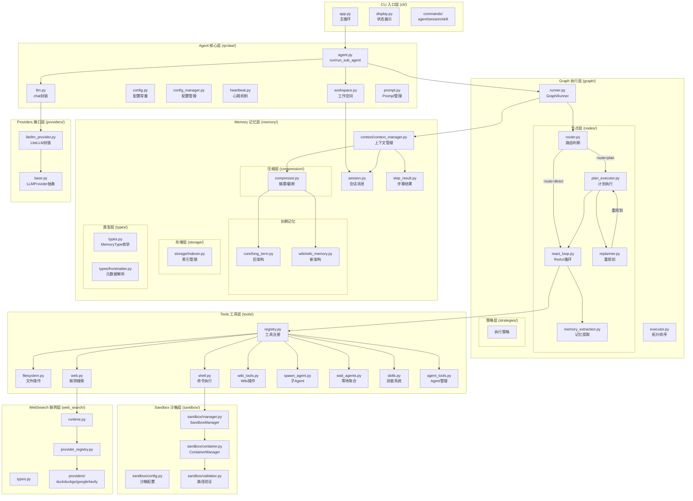

# QRClaw 架构分析报告

**版本**: v1.0  
**生成日期**: 2026-04-12  
**基于**: 源码深度分析

---

## 一、整体架构图



---

## 二、各层职责说明

### 2.1 Graph 执行层 (graph/)

**定位**: 执行引擎核心，负责任务的分发、编排与重规划

| 组件 | 职责 | 关键逻辑 |
|------|------|----------|
| `runner.py` | GraphRunner，流程入口 | Router → ReactLoop/PlanExecutor 分支；子agent跳过路由 |
| `executor.py` | 拓扑排序工具 | `get_next_layer()` 计算可并行执行的步骤层 |
| `nodes/router.py` | 路由判断 | 判断任务复杂度，输出 `RouteResult{route:"direct"|"plan"}` |
| `nodes/react_loop.py` | ReAct循环 | `run_react_loop()` 通用函数：推理→工具调用→结果回写→循环 |
| `nodes/plan_executor.py` | 计划执行 | 串行/并行混合执行，`while remaining` 驱动 |
| `nodes/replanner.py` | 重规划 | 根据战报评估目标达成，输出新的剩余步骤 |
| `nodes/memory_extraction.py` | 记忆提取 | Token/工具调用双阈值触发，批量写入Wiki |

**执行流程**:
```
用户输入 → Router.run() → RouteResult
    ├── route=direct → ReactLoopNode.run()
    └── route=plan  → PlanExecutorNode.run()
                          ├── while remaining:
                          │     ├── get_next_layer() → 可执行层
                          │     ├── 串行: _run_serial() → run_sub_agent()
                          │     ├── 并行: _run_parallel() → threading.Thread
                          │     ├── add_step_result() → 追加past_steps
                          │     └── Replanner.run() → 评估/重规划
                          └── ReactLoopNode.run() → 整合结果
```

---

### 2.2 Memory 记忆层 (memory/)

**定位**: 6层记忆架构，支持短期会话到长期Wiki持久化

| 层级 | 组件 | 职责 |
|------|------|------|
| L1 短期 | `context/session.py` | 单次会话消息历史，JSON持久化 |
| L2 上下文 | `context/context_manager.py` | 统一上下文中心，System Prompt缓存，线程单例 |
| L3 Step结果 | `context/step_result.py` | 串行步骤间的执行结果追溯 |
| L4 压缩 | `compression/compressor.py` | `summarize()`递归摘要，`truncate()`截断，目标20-25% |
| L5 长期(旧) | `core/long_term.py` | 四分类记忆管理器 |
| L5 长期(新) | `wiki/wiki_memory.py` | WikiPage单例模式，按workspace缓存 |
| L6 索引 | `storage/indexer.py` | MemoryIndexer，Dirty Flag缓存 |

**调用链路**:
```
Workspace初始化 → Session创建 → init_context_manager()
                                            ↓
                            ContextManager.build_messages(role)
                                   ├─ role="react"    → System+完整消息
                                   ├─ role="router"   → System+过滤消息
                                   └─ role="replanner"→ PlanState构建
                                            ↓
                              每轮对话结束 → compress_if_needed()
                                            ↓
                              summarize() → 递归摘要 → 长期记忆写入
```

---

### 2.3 Tools 工具层 (tools/)

**定位**: 工具注册与执行，支持ReAct循环调用

| 组件 | 工具 | 说明 |
|------|------|------|
| `registry.py` | 装饰器注册 | `@register(description, args_model, confirm, agents)` |
| `filesystem.py` | read_file, write_file, list_directory, str_replace, grep_code | 沙箱路径映射 `/workspace` → 实际目录 |
| `shell.py` | run_shell | 自动检测沙箱，降级执行 |
| `web.py` | web_search, web_fetch | 通过Jina.ai提取正文 |
| `wiki_tools.py` | write_wiki_page, read_wiki_page, delete_wiki_page | 仅MAIN agent |
| `spawn_agent.py` | spawn_agent | 子agent共享父workspace，沙箱按需创建/销毁 |
| `wait_agents.py` | wait_agents | thread.join()阻塞等待 |
| `skills.py` | use_skill | 加载workspace/skills/的YAML定义 |
| `agent_tools.py` | create_agent, delete_agent | Agent工作空间操作 |

**权限过滤（两层）**:
```
层级1: _AGENT_TOOL_WHITELIST
        MAIN = 全量工具
        SUB  = 限定白名单 (filesystem, shell, web, skills)

层级2: @register(agents=[AgentType.MAIN])
        wiki_tools等仅MAIN可见
```

**Schema生成**:
- Pydantic BaseModel → OpenAI Function Calling格式
- `_build_schema()` 递归展开 `$ref`
- 兼容Gemini格式

---

### 2.4 Providers 接口层 (providers/)

**定位**: 统一封装100+ LLM提供商

| 组件 | 说明 |
|------|------|
| `base.py` | `LLMProvider` ABC，`LLMResponse`/`ToolCall` 数据结构 |
| `litellm_provider.py` | LiteLLM统一封装，自动推断provider前缀 |

**关键设计**:
- 模型格式: `provider/model-name` (如 `minimax/MiniMax-M2.7-highspeed`)
- 重试策略: 3次指数退避 (`2^attempt`秒)
- 可重试异常: `RateLimitError`, `ServiceUnavailableError`, `APIConnectionError`
- finish_reason修正: 有tool_calls时强制设为 `"tool_calls"`

---

### 2.5 CLI 入口层 (cli/)

**定位**: 用户交互入口，命令解析与结果显示

| 组件 | 职责 |
|------|------|
| `app.py` | 主循环，argparse解析，`/agent`, `/session`, `/skill` 子命令分发 |
| `display.py` | 状态栏渲染，Token使用率颜色阈值 |
| `commands/agent.py` | agent list/new/switch/delete |
| `commands/session.py` | session list/new/switch/delete |
| `commands/skill.py` | skill list/import |

**启动序列**:
```python
1. argparse参数解析 → 确定agent_id, heartbeat开关
2. Workspace(agent_id) → 确定sessions/logs/skills目录
3. 延迟导入 → import qrclaw.tools (触发注册)
4. Session(resume=True/False) → 恢复/新建会话
5. setup_logger() → 初始化日志
6. start_heartbeat() → 可选心跳
7. 主循环 → 输入处理 → run()
```

---

### 2.6 Agent 核心层 (qrclaw/)

**定位**: 全局单例与依赖注入

| 组件 | 职责 |
|------|------|
| `agent.py` | `run()`主入口委托GraphRunner；`run_sub_agent()`子agent；线程本地存储 |
| `llm.py` | 简单chat封装，调用provider |
| `config.py` | 配置常量：`MODEL_MAX_TOKENS=128000`，`COMPRESS_THRESHOLD=60%` |
| `config_manager.py` | `~/.qrclaw/config.yaml` 读写，点号路径支持 |
| `heartbeat.py` | 定期维护任务（记忆清理/自我反思） |
| `workspace.py` | 路径管理，agent/session/skills目录确定 |
| `prompt.py` | Prompt模板管理 |

---

### 2.7 Sandbox 沙箱层 (sandbox/)

**定位**: 安全的代码执行环境（Docker容器）

| 组件 | 职责 |
|------|------|
| `manager.py` | SandboxManager单例，生命周期管理 |
| `container.py` | ContainerManager，底层调用docker命令 |
| `config.py` | 容器配置常量 |
| `validator.py` | 路径验证，禁止挂载敏感路径 |

**容器配置**:
- 镜像: `python:3.11-slim`
- 内存: 512MB
- PIDs: 256
- 安全: `--read-only`, `--cap-drop ALL`, `--network none`
- 挂载验证: 禁止 `~/.ssh`, `/etc`, `/root`

---

### 2.8 WebSearch 联网层 (web_search/)

**定位**: 多提供商联网搜索抽象

| 组件 | 说明 |
|------|------|
| `runtime.py` | 搜索运行时 |
| `types.py` | 类型定义 |
| `provider_registry.py` | 提供商注册 |
| `providers/duckduckgo.py` | DuckDuckGo实现 |
| `providers/google.py` | Google实现 |
| `providers/tavily.py` | Tavily实现 |

---

## 三、核心数据流

### 3.1 主流程数据流

```
用户输入
    │
    ▼
┌─────────────────────────────────────────────────────────────┐
│                     ContextManager                          │
│              build_messages(role="react")                   │
│                     - System Prompt                         │
│                     - 完整消息历史                           │
└─────────────────────────────────────────────────────────────┘
    │
    ▼
┌─────────────────────────────────────────────────────────────┐
│                       GraphRunner                           │
│                    run(user_input, ...)                     │
└─────────────────────────────────────────────────────────────┘
    │
    ▼
┌─────────────────────────────────────────────────────────────┐
│                      RouterNode                             │
│              判断: route=direct | route=plan                │
│              输出: RouteResult                               │
└─────────────────────────────────────────────────────────────┘
    │
    ├─── route=direct ──────────────────────────────────────►
    │                                                          │
    ▼                                                          ▼
┌──────────────────────┐                    ┌──────────────────────────────┐
│   ReactLoopNode      │                    │      PlanExecutorNode         │
│                      │                    │                               │
│ run_react_loop()     │                    │ while remaining:              │
│  ├─ LLM推理          │                    │   ├─ get_next_layer()        │
│  ├─ 工具调用         │                    │   ├─ _run_serial() / parallel │
│  ├─ 结果回写         │                    │   ├─ Replanner.run()          │
│  └─ 循环             │                    │   └─ update_remaining()        │
│                      │                    │                               │
│  Token≥10000         │                    │   完成后 → ReactLoopNode      │
│   + 工具≥3 → 记忆提取 │                    └──────────────────────────────┘
└──────────────────────┘
    │
    ▼
┌─────────────────────────────────────────────────────────────┐
│                     MemoryExtraction                        │
│              check_and_extract() → flush_pending()         │
│              create / append → WikiMemory                   │
└─────────────────────────────────────────────────────────────┘
    │
    ▼
┌─────────────────────────────────────────────────────────────┐
│                       Session                               │
│         messages.append() → JSON持久化                      │
│         compress_if_needed() → 阈值触发压缩                  │
└─────────────────────────────────────────────────────────────┘
    │
    ▼
CLI输出结果
```

### 3.2 计划执行数据流（route=plan）

```
PlanExecutorNode.run()
    │
    ▼
while ctx.plan_state.remaining:
    │
    ├─► get_next_layer(remaining_steps)
    │      拓扑排序，返回 in_degree=0 的可执行层
    │
    ├─► 判断层大小:
    │      len(layer) == 1 → 串行
    │      len(layer) > 1  → 并行
    │
    ├─► 串行执行:
    │      _run_serial()
    │        └─► run_sub_agent_fn(step) → Agent.run_sub_agent()
    │              └─► ReactLoopNode.run() → 结果
    │
    ├─► 并行执行:
    │      _run_parallel()
    │        └─► threading.Thread(target=run_sub_agent_fn)
    │
    ├─► ctx.add_step_result(past_steps.append())
    │
    ├─► Replanner.run()
    │      评估: goal已达成 → return None
    │      评估: 需调整 → return list[PlanStep]
    │
    └─► ctx.update_remaining(new_remaining)

所有remaining处理完毕 → ReactLoopNode.run() 整合
```

---

## 四、模块依赖关系

```
CLI (cli/app.py)
  ├─► Workspace (workspace.py)
  ├─► Session (memory/session.py)
  ├─► run() → Agent (agent.py)
  │     ├─► GraphRunner (graph/runner.py)
  │     │     ├─► RouterNode (graph/nodes/router.py)
  │     │     │     └─► LiteLLMProvider (providers/litellm_provider.py)
  │     │     ├─► ReactLoopNode (graph/nodes/react_loop.py)
  │     │     │     ├─► ToolRegistry (tools/registry.py)
  │     │     │     └─► LiteLLMProvider
  │     │     ├─► PlanExecutorNode (graph/nodes/plan_executor.py)
  │     │     │     └─► ReactLoopNode (递归)
  │     │     ├─► ReplannerNode (graph/nodes/replanner.py)
  │     │     │     └─► LiteLLMProvider
  │     │     └─► MemoryExtractionNode (graph/nodes/memory_extraction.py)
  │     │           └─► WikiMemory (memory/wiki/wiki_memory.py)
  │     ├─► ContextManager (memory/context/context_manager.py)
  │     │     ├─► Session
  │     │     ├─► Compressor (memory/compression/compressor.py)
  │     │     │     └─► WikiMemory
  │     │     └─► StepResult (memory/step_result.py)
  │     └─► Thread-Local Storage
  │
  ├─► Tools (tools/)
  │     ├─► ToolRegistry
  │     ├─► SandboxManager (sandbox/manager.py)
  │     │     └─► ContainerManager (sandbox/container.py)
  │     └─► WikiMemory
  │
  └─► Heartbeat (heartbeat.py)
        ├─► Session
        └─► WikiMemory
```

---

## 五、当前架构优点

### 5.1 模块化解耦
- **Graph/Node分离**: 执行逻辑与节点实现解耦，新增节点只需实现Node接口
- **Provider抽象**: `LLMProvider` ABC支持任意LLM服务商
- **ToolRegistry**: 装饰器注册机制，新增工具零修改核心代码

### 5.2 ReAct循环通用化
- `run_react_loop()` 函数抽离，供Router、PlanExecutor、MemoryExtraction多节点复用
- 回调机制 (`on_tool_call`, `on_finish`) 支持权限确认等扩展
- 工具结果自动注入messages，供LLM下一轮推理

### 5.3 Wiki记忆持久化
- `WikiMemory` 单例模式，按workspace缓存实例
- `WikiPage` 页面式存储，支持create/append语义
- IndexManager维护三文件索引: `index.json`, `index.md`, `log.md`

### 5.4 双长期记忆架构
- **旧架构**: 四分类（user/feedback/project/reference），向后兼容
- **新架构**: WikiPage式，语义更清晰
- 双轨并行，平滑迁移路径

### 5.5 上下文管理精细化
- **Thread-Local单例**: `ContextManager`线程级隔离，安全并发
- **Dirty Flag缓存**: System Prompt缓存失效标记，延迟重建
- **分层压缩**: 递归摘要 + 近期保留，20-25%压缩率

### 5.6 计划执行灵活性
- **拓扑排序**: 自动发现可并行步骤
- **串行/并行混合**: 依赖步骤串行，无关步骤并行
- **战报驱动重规划**: 根据真实执行结果动态调整

### 5.7 沙箱安全隔离
- Docker容器级隔离
- 敏感路径挂载禁止
- 无沙箱模式fallback

---

## 六、当前架构问题与重构建议

### 6.1 双长期记忆架构并存（高优先级）

**问题**:
- `core/long_term.py` 与 `wiki/wiki_memory.py` 功能重叠
- 两套索引系统维护成本高
- 新增记忆操作需同步两套实现

**建议**:
```
1. 确定单一长期记忆入口（推荐WikiMemory）
2. 废弃core/目录，迁移现有MEMORY.md数据到wiki/pages/
3. LongTermMemory类作为WikiMemory的别名/封装层
4. 更新Compressor调用点，统一使用WikiMemory API
```

### 6.2 上下文窗口超限处理缺失（高优先级）

**问题**:
- `context window exceeds limit` 异常未被捕获
- 当前重试逻辑未区分可恢复/不可恢复异常
- 上下文截断依赖LLM自动处理，结果不稳定

**建议**:
```python
# providers/litellm_provider.py 重试逻辑增强
try:
    response = litellm.completion(...)
except BadRequestError as e:
    if "context window" in str(e):
        # 触发上下文压缩
        compress_context()
        # 重试
        return self.chat(messages, ...)
    raise  # 其他BadRequestError仍抛出
```

### 6.3 ContextManager.build_messages() 职责过重（中优先级）

**问题**:
- 单一函数承担: System Prompt构建、消息过滤、角色适配
- role参数枚举膨胀: "react", "router", "replanner", ...
- 新增节点需修改build_messages

**建议**:
```python
# 按节点拆分build方法
class ContextManager:
    def build_react_messages(self) -> list[dict]: ...
    def build_router_messages(self) -> list[dict]: ...
    def build_replanner_messages(self) -> list[dict]: ...
    
# 或采用策略模式
class MessageBuilder(ABC):
    @abstractmethod
    def build(self, ctx: ContextManager) -> list[dict]: ...

class ReactMessageBuilder(MessageBuilder): ...
class RouterMessageBuilder(MessageBuilder): ...
```

### 6.4 工具权限白名单硬编码（中优先级）

**问题**:
- `_AGENT_TOOL_WHITELIST` 硬编码在 `registry.py`
- SUB agent工具集受限，无法运行时配置
- 新增工具需同步更新白名单

**建议**:
```python
# 配置文件支持
# .qrclaw/agents.yaml
agents:
  main:
    tools: ["*"]  # 所有工具
  sub:
    tools:
      - filesystem.*
      - shell.run_shell
      - web.*
      - skills.use_skill

# 运行时加载
TOOL_WHITELISTS = load_agent_whitelists()
```

### 6.5 子Agent共享Workspace隐患（低优先级）

**问题**:
- 子agent与父agent共享同一Workspace
- Session/记忆可能被并发写入
- 日志session_id冲突风险

**建议**:
```python
# 方案1: 子agent独立Session
# spawn_agent时创建独立Session
def spawn_agent(..., session_id=None):
    if session_id is None:
        session_id = f"{parent_session}_sub_{uuid}"
    return run_sub_agent(..., session_id=session_id)

# 方案2: Workspace只读，Session独立
# 子agent可读取父agent上下文，但写入独立Session
```

### 6.6 重规划Prompt固定（中优先级）

**问题**:
- `ReplannerNode` 的重规划Prompt硬编码
- 无法根据任务类型调整重规划策略
- 失败重试逻辑简单（仅禁止重复失败步骤）

**建议**:
```python
# 重规划策略抽象
class ReplanStrategy(ABC):
    @abstractmethod
    def should_replan(self, past_steps, remaining, goal) -> bool: ...
    
    @abstractmethod
    def generate_new_steps(self, ...) -> list[PlanStep]: ...

class ConservativeReplan(ReplanStrategy):
    """保守策略: 仅在明确失败时重规划"""

class AggressiveReplan(ReplanStrategy):
    """激进策略: 持续优化，即使无失败"""
```

### 6.7 缺少错误分类与恢复机制（低优先级）

**问题**:
- 工具执行异常统一抛出RuntimeError
- 无法区分: 权限拒绝、参数错误、超时、限流
- 缺少重试/降级/放弃的分类处理

**建议**:
```python
# 工具错误分类
class ToolError(Exception):
    pass

class PermissionError(ToolError):
    """权限不足，需要用户确认"""

class TimeoutError(ToolError):
    """执行超时，可重试"""

class ParameterError(ToolError):
    """参数错误，无法重试"""

# 节点层分类处理
try:
    result = registry.execute(tool_name, args)
except PermissionError as e:
    console.print("[yellow]需要权限确认[/yellow]")
    raise  # 或暂停等待用户
except TimeoutError as e:
    # 指数退避重试
    ...
except ParameterError as e:
    # 立即终止
    raise
```

---

## 七、重构优先级汇总

| 优先级 | 问题 | 涉及模块 | 建议 |
|--------|------|----------|------|
| P0 | 上下文窗口超限崩溃 | providers/litellm_provider.py | 增加BadRequestError处理+压缩触发 |
| P1 | 双长期记忆架构并存 | memory/core/ vs memory/wiki/ | 统一WikiMemory入口，废弃core/ |
| P2 | build_messages职责膨胀 | memory/context/context_manager.py | 拆分MessageBuilder策略 |
| P2 | 工具白名单硬编码 | tools/registry.py | 配置化，支持运行时调整 |
| P3 | 子Agent Workspace共享 | tools/spawn_agent.py | Session隔离或只读Workspace |
| P3 | 重规划Prompt固定 | graph/nodes/replanner.py | 抽象ReplanStrategy |
| P4 | 错误分类缺失 | tools/registry.py | 异常分类+分类处理 |

---

## 八、附录

### A. 关键文件索引

| 路径 | 核心功能 |
|------|----------|
| `/qrclaw/agent.py` | Agent主入口，线程本地存储 |
| `/qrclaw/graph/runner.py` | GraphRunner，流程入口 |
| `/qrclaw/graph/executor.py` | 拓扑排序工具 |
| `/qrclaw/graph/nodes/router.py` | 路由判断 |
| `/qrclaw/graph/nodes/react_loop.py` | ReAct循环 |
| `/qrclaw/graph/nodes/plan_executor.py` | 计划执行 |
| `/qrclaw/graph/nodes/replanner.py` | 重规划 |
| `/qrclaw/graph/nodes/memory_extraction.py` | 记忆提取 |
| `/qrclaw/memory/context/context_manager.py` | 上下文管理 |
| `/qrclaw/memory/wiki/wiki_memory.py` | Wiki长期记忆 |
| `/qrclaw/tools/registry.py` | 工具注册 |
| `/qrclaw/providers/litellm_provider.py` | LiteLLM封装 |
| `/qrclaw/sandbox/manager.py` | 沙箱管理 |

### B. 配置常量速查

| 常量 | 值 | 位置 |
|------|-----|------|
| MODEL_MAX_TOKENS | 128000 | config.py |
| COMPRESS_THRESHOLD | 60% | config.py |
| COMPRESS_TARGET | 20-25% | config.py |
| MAX_ITERATIONS | 100 | config.py |
| MEMORY_TOKEN_THRESHOLD | 10000 | memory_extraction.py |
| MEMORY_TOOL_THRESHOLD | 3 | memory_extraction.py |

### C. 关键枚举

| 枚举 | 值 | 用途 |
|------|-----|------|
| AgentType | MAIN, SUB | 工具可见性控制 |
| MemoryType | user, feedback, project, reference | 旧架构分类 |
| RouteType | direct, plan | Router输出 |
| MemoryExtractionAction | create, append | Wiki操作类型 |
